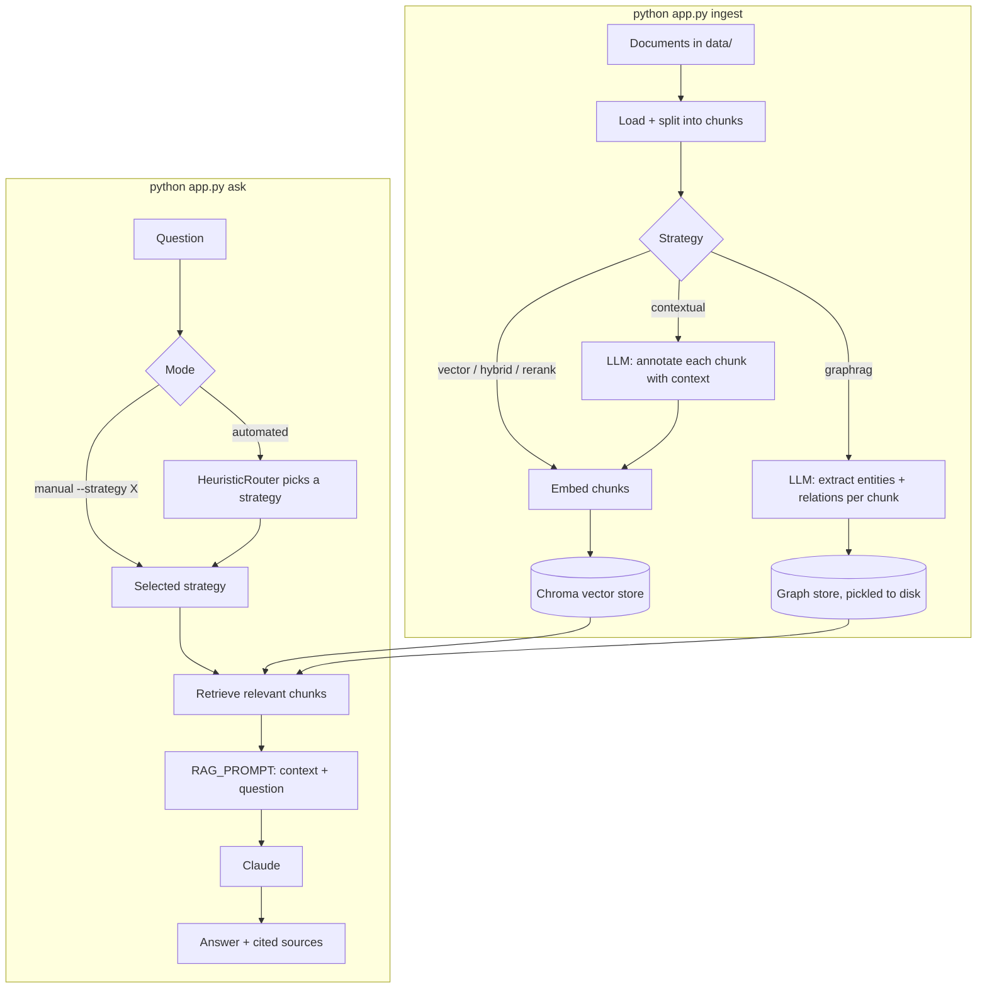

# Document Reviewer Agent

A command-line RAG (Retrieval-Augmented Generation) agent that answers
questions about your own documents using Claude. It supports six
interchangeable retrieval strategies, selectable by hand or picked
automatically by a rule-based router, with optional LangSmith tracing.

## Architecture



Ingestion turns your documents into either a searchable vector index
(most strategies) or a graph of extracted facts (`graphrag`), or both.
Asking a question retrieves relevant content — chosen either by you
(`--strategy`) or by the router (`--mode automated`) — and hands it to
Claude alongside the question to produce a grounded, cited answer.

## Retrieval strategies

| Strategy | What it does | Best for |
|---|---|---|
| `vector` | Meaning-based similarity search (the baseline) | General-purpose default |
| `hybrid` | Vector search + keyword (BM25) search, merged | Exact terms, codes, quoted phrases |
| `rerank` | Broad vector search, then a cross-encoder re-scores the top candidates | When the default's top result feels slightly off |
| `contextual` | Chunks are annotated with context by an LLM before embedding | Chunks that lose meaning out of context |
| `agentic` | The LLM decides for itself how many times to search | Vague or multi-part questions |
| `graphrag` | Entities/relations extracted into a graph, answered via traversal | Multi-fact comparisons and relationships |

See [`docs/retrieval-strategies.md`](docs/retrieval-strategies.md) for
a full plain-language explanation, worked examples, and the math
behind each one.

## Getting started

**Prerequisites**: Python 3.9+, an [Anthropic API key](https://console.anthropic.com/).

```bash
python -m venv .venv
source .venv/bin/activate
pip install -r requirements.txt

cp .env.example .env
# then edit .env and set ANTHROPIC_API_KEY
```

### Ingest your documents

```bash
python app.py ingest                       # ingests data/, strategy: vector (shared by vector/hybrid/rerank/agentic)
python app.py ingest --strategy contextual # separate index, one LLM call per chunk
python app.py ingest --strategy graphrag --force  # separate graph, one LLM call per chunk (opt-in, see cost notes below)
```

### Ask questions

```bash
python app.py ask                          # manual mode, uses settings.retrieval_strategy (default: vector)
python app.py ask --strategy hybrid        # manual mode, forces a specific strategy
python app.py ask --mode automated         # router picks a strategy per question
```

`--strategy` and `--mode automated` are mutually exclusive — pick one.

## CLI reference

```
python app.py ingest [directory]
    --strategy {vector,hybrid,rerank,contextual,agentic,graphrag}  (default: vector)
    --force     required for graphrag; for contextual, only needed
                past the chunk-count safety limit

python app.py ask
    --strategy {vector,hybrid,rerank,contextual,agentic,graphrag}  (default: from .env)
    --mode {manual,automated}  (default: manual)
```

## Cost and safety notes

Three strategies make LLM calls beyond the final answer generation —
each has a hard cap so a run can't silently balloon in cost:

- **`contextual`** — one LLM call per chunk at ingest. Capped at
  `MAX_CONTEXTUAL_CHUNKS` (200); pass `--force` to exceed it deliberately.
- **`agentic`** — the LLM can search multiple times per question.
  Capped at `MAX_AGENT_ITERATIONS` (3 loop turns) and
  `MAX_SEARCHES_PER_QUESTION` (3 searches) — hard stops, not suggestions.
- **`graphrag`** — one LLM call per chunk at ingest, plus query-time
  calls. Capped at `MAX_GRAPHRAG_CHUNKS` (50), checked *before* any LLM
  call runs. Always requires `--force` to ingest, since it's the most
  expensive strategy of the six.

## Observability (optional)

Set the `LANGSMITH_*` variables in `.env` (see `.env.example`) to trace
every chain invocation in [LangSmith](https://smith.langchain.com/) —
no code changes needed, since every chain in this project is built
with LangChain's LCEL.

## Testing

```bash
pytest
```

Most tests make real Anthropic API calls (no mocking) against the
sample docs in `data/` — expect them to take a couple of minutes and
to consume some API credits.

## Project structure

```
app.py                          CLI entry point (ingest / ask)
document_reviewer/
  config/                       settings.py (typed config), prompts.py
  tools/                        one module per retrieval strategy, + registry
  loader.py, splitter.py        document loading and chunking
  embeddings.py, vector_store.py  embedding model, Chroma persistence
  llm.py                        Claude wrapper
  rag_chain.py                  the retrieve -> generate pipeline
  router.py                     HeuristicRouter (+ LLMRouter stub)
data/                           sample documents (ingested by default)
docs/                           project documentation
tests/                          pytest suite
```

## License

[MIT](LICENSE)
